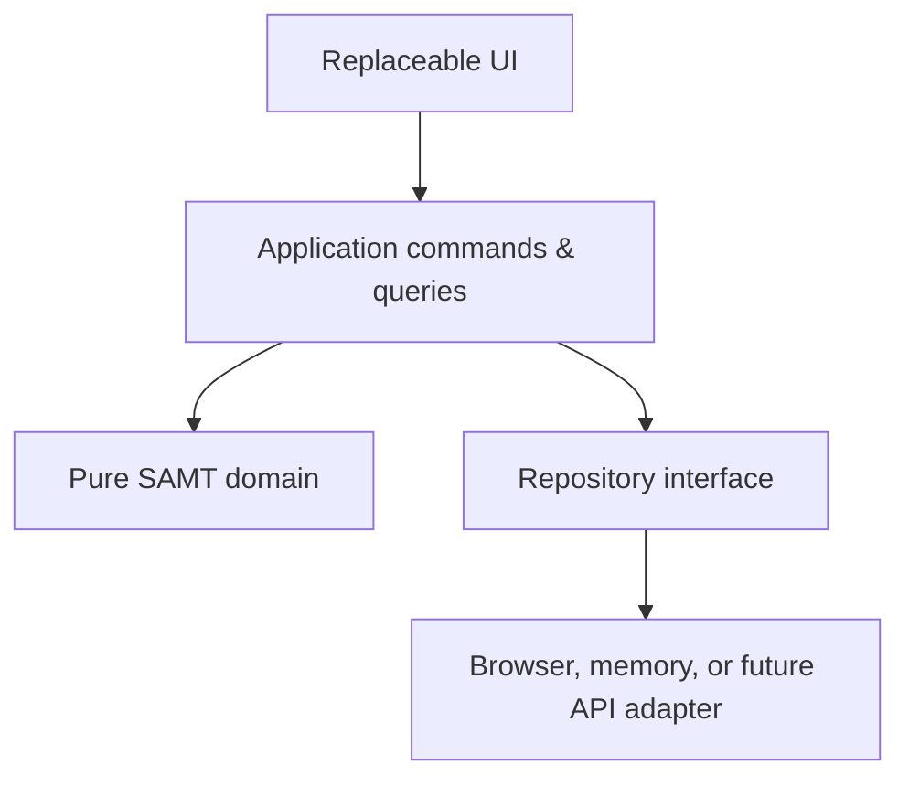

# SAMT modular engine architecture

## Purpose

SAMT is a domain engine with a replaceable client. The vanilla browser client in
this repository is a reference adapter, not the definition of SAMT. A future
Next.js, desktop, Android, or iOS client should reuse `js/domain` and
`js/application` without importing any browser view.

## Dependency direction

- **Domain (`js/domain`)** contains deterministic rules and plain serialisable
  data transformations. It never imports DOM or persistence APIs.
- **Application (`js/application`)** owns commands, queries, orchestration,
  lifecycle reconciliation, events, Home and Analysis view models.
- **Infrastructure (`js/infrastructure`)** implements clocks, the repository,
  IndexedDB/local-storage compatibility, backups and logical transactions.
- **UI (`js/ui`)** renders view models, binds controls and routes. It contains no
  Target, Cycle, Avoid, scheduling, aggregation, or completion formulas.
- **Import/export (`js/import-export`)** owns the canonical package serializer,
  validation, conflict planning and schema/package migrations.

## Storage compatibility and migration

The browser adapter deliberately keeps the original contracts:

| Contract | Value |
| --- | --- |
| IndexedDB database | `life-command-v1-db` |
| Object store | `app` |
| State record | `life-command-v1-state` |
| Fallback key | `life-command-v1-fallback` |
| Recovery key | `life-command-v1-recovery` |

Internal storage versioning is separate from package schema versioning. The
engine currently uses internal storage version 3, while the external
SAMT/Life Command package schema remains version 2.

Startup performs one explicit pipeline:

1. Read all known legacy candidates.
2. Select the newest timestamped candidate; prefer the IndexedDB primary when
   timestamps tie, then fall back to record richness.
3. Validate its legacy shape.
4. Save a complete, immutable, version-keyed pre-migration backup before any
   migration transform.
5. Apply additive migration only—no IDs are regenerated and no user records are
   removed.
6. Validate domain identities, references, names, Block graph, Targets and
   Avoid configuration.
7. Reconcile temporal state deterministically.
8. Commit the resulting state.

If steps 5–7 fail, the new state is not committed. The old database and backup
remain available. A fresh origin creates an empty state; it never recreates
Breakfast, Lunch, Dinner, Hydration, prayers, workouts, or other starter data.

Android may assign a distinct origin to each `content://` download. Browser
security prevents one origin from reading another origin's IndexedDB. The safe
cross-origin path is Full Backup export from the old file followed by import in
the new file.

## Commands and transactions

All writes go through `SamtEngine.transact()` and an explicit command. A command
receives a candidate state, an injected timestamp, and an ID factory. The
candidate is validated before the repository commits it. Examples include:

- `createAction`, `updateAction`, `logAction`, `deleteActionLog`
- `updateActionLog` (a correction record preserves the previous snapshot)
- `createBlock`, `updateBlock`, `addBlockChild`, `removeBlockChild`
- `activateBlock`, `pauseBlock`, `resumeBlock`
- `startRun`, `pauseRun`, `resumeRun`, `finishRun`
- `completeOccurrence`, `skipOccurrence`, `advanceCycle`
- `startPeriod`, `closePeriod`
- `setPrimaryProject`, `restoreDefinition`
- `commitImport`, `undoImport`, `reconcileTemporalState`

The browser UI never mutates global data directly.

## Queries and view models

Reads use `engine.queries`. Home is produced by `getHomeViewModel()` and already
separates running work, positive Due, Avoid status, daily Targets, weekly
Targets, primary Project, upcoming occurrences and Quick Log options. Analysis
is produced by `getAnalysisViewModel()` from factual logs, occurrences, Runs and
period records.

## One Action Log

`logActionCommand` writes one Action Log for one real event. It attaches arrays
of eligible `linkedBlockIds`, `linkedRunIds`, and `linkedOccurrenceIds` to that
same record. Parent Target and Analysis attribution is derived recursively.
Global totals always deduplicate by Action Log ID. The factual event timestamp
is distinct from `recordedAt`, so a backdated entry is evaluated in the period
where it actually happened. Corrections recompute affected Occurrences and Runs
atomically while retaining the previous log snapshot in History.

## Time and lifecycle

Domain rules never call `Date.now()`. A `SystemClock` supplies production time;
tests use `FakeClock`. Period and schedule functions receive a timezone and use
local calendar boundaries. Zoned midnight conversion accounts for daylight
saving changes.

`reconcileTemporalState({ now, timezone })` is the only automatic temporal
transition service. It closes expired Target/Avoid periods, marks expired
Occurrences, applies Cycle end policies, and creates scheduled Occurrences using
deterministic temporal IDs. It walks every missed local-calendar window after
an offline gap, not only the current window. Re-running it at the same timestamp
is idempotent.

Target, Avoid, Cycle, Occurrence and Run records capture the definition details
needed to interpret their own lifetime. Editing a definition during an open
period changes the next period; it does not rewrite the current or historical
evaluation scope.

## Definitions and runtime state

- Block definitions describe reusable structure.
- Activations describe current use and recurrence.
- Runs describe finite executions and keep snapshots.
- Occurrences describe scheduled Action instances.
- Target/Avoid period records describe bounded evaluation windows.

`active`, `running`, and `due` are separate states. A Collection has a runtime
detail route but no fake Run or completion. `/blocks/:id` opens; only
`/blocks/:id/edit` edits. Runtime views consume application query results for
current Runs, Cycle position, evaluation periods and Occurrences; they do not
derive lifecycle rules in the DOM.

Definitions moved to the Bin retain their stable IDs and snapshots for ten
days. Restoring a definition does not falsely reopen already cancelled Runs or
skipped Occurrences. Before every import, the application saves an exact Restore
Point; Undo Import restores that snapshot byte-for-byte at the state-object
level.

## Porting later

The next extraction can move `js/domain`, `js/application`, `js/shared`, and
`js/import-export` into a `packages/samt-core` package. A Next.js or native
client then supplies its own repository adapter, clock and view layer. No
server sync is implemented in this phase.
